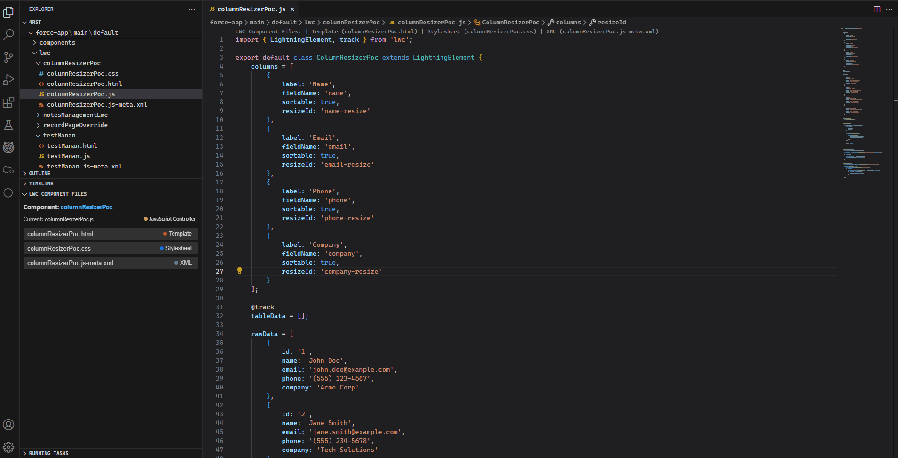

# LWC File Switcher

A Visual Studio Code extension to quickly switch between files of a Lightning Web Component (LWC).

## Features

This extension allows you to quickly navigate between different files of a Lightning Web Component:
- Switch between HTML, JS, CSS, and configuration files with a single keyboard shortcut
- Access all component files from the editor context menu
- **Explorer Panel** - View and access all component files directly from the Explorer sidebar
- **Smart Prioritization** - Files are sorted by importance, with HTML/JS/CSS first and configuration/test files last
- **Color Coding** - Easily distinguish between different file types with intuitive color coding
- **Theme Compatible** - Works seamlessly in both light and dark VS Code themes
- **Unsaved Indicators** - See at a glance which files have unsaved changes with pulsing blue dots
- **Test Files Support** - Automatically finds and includes test files in the `__tests__` folder
- **Code Lens** - View and switch to component files directly from the editor
- **Status Bar** - Always visible component switcher in the status bar
- Supports all LWC file types including:
  - HTML templates (`.html`) - Orange
  - JavaScript controllers (`.js`) - Yellow
  - CSS stylesheets (`.css`) - Blue
  - Configuration files (`.js-meta.xml`) - Orange-Red
  - Test files (`.test.js` or in `__tests__` folder) - Purple
  - SVG resources (`.svg`) - Amber

## Demo

Watch these short demonstrations of the extension in action:

### Quick File Switching

## How to Use

1. Open any file belonging to an LWC component (HTML, JS, CSS, etc.)
2. Use one of the following methods to switch to another file in the component:
   - **Using Explorer Panel**: The LWC Component Files panel in the Explorer sidebar shows all related files
   - **Using Status Bar**: Click on the "LWC: componentName" item in the status bar (always visible)
   - **Using Code Lens**: Click on one of the file links shown at the top of the file
   - Press `Alt+O` (Windows/Linux) or `Option+O` (Mac)
   - Right-click in the editor and select "LWC: Switch Component File" from the context menu
   - Open the Command Palette (`Ctrl+Shift+P` or `Cmd+Shift+P`) and search for "LWC: Switch Component File"
3. Select the component file you want to open

### Toggle Explorer Panel

You can toggle the Explorer panel on/off by:
1. Opening the Command Palette (`Ctrl+Shift+P` or `Cmd+Shift+P`)
2. Searching for "LWC: Toggle Component Files Panel"

## Requirements

- Visual Studio Code version 1.98.0 or higher

## Extension Settings

This extension contributes the following settings:

* `lwcFileSwitcher.enableCodeLens`: Enable/disable code lens for switching between component files (default: true)
* `lwcFileSwitcher.enableStatusBar`: Enable/disable the status bar item for quick file switching (default: true)
* `lwcFileSwitcher.enableStickyHeader`: Enable/disable the LWC Component Files panel in the Explorer sidebar (default: true)

## Known Issues

- None currently

**Enjoy!**
